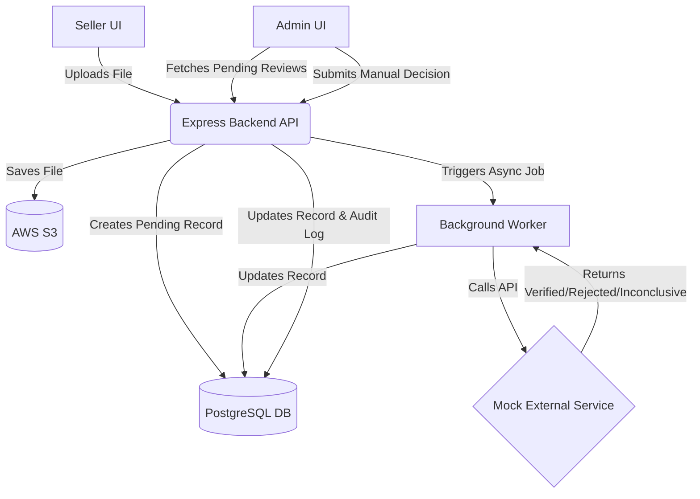
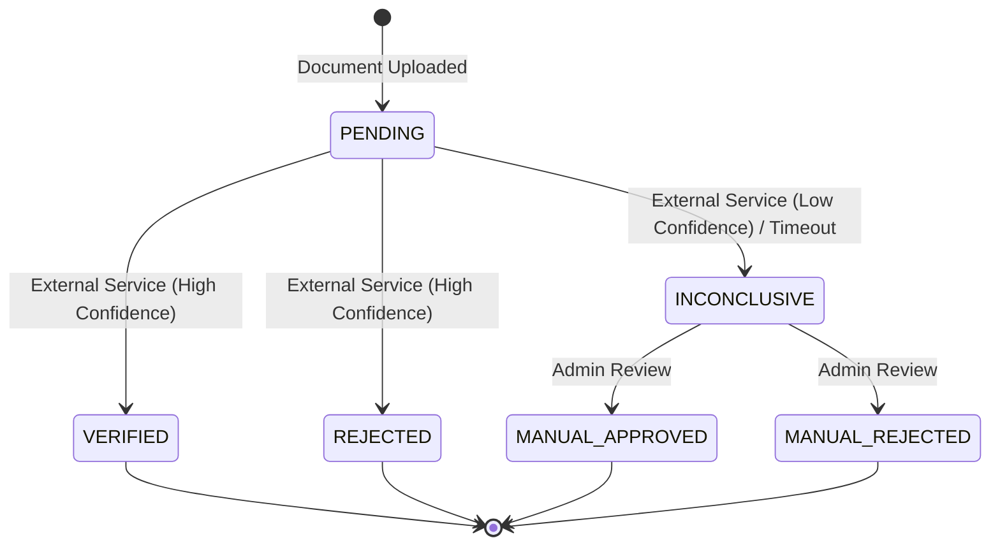

# Document Verification Workflow - Design Document

## 1. Problem Framing
- **What is the real problem this feature solves?** The platform needs to establish trust and maintain a safe marketplace environment by verifying the legitimacy of sellers before they can transact. The goal is to minimize fraud and legal risk without causing unnecessary friction for legitimate sellers during onboarding.
- **Who are the stakeholders?**
  - **Sellers:** Want a quick, transparent, and seamless onboarding process so they can start selling and making money ASAP.
  - **Platform Admins:** Need an efficient, organized queue to handle exceptions (inconclusive checks) without being overwhelmed, with clear audit trails for compliance.
  - **The Platform/Business:** Needs to balance rapid seller acquisition (growth) with strict compliance and risk mitigation (security).
- **What's explicitly out of scope for this feature?**
  - OCR or manual parsing of the uploaded documents. We rely completely on the external verification service for automated decisions.
  - Seller registration, complex multi-step onboarding, and auth flows (we assume they are authenticated and authorized to upload).
  - Billing or integration with the actual marketplace listing systems.

## 2. Clarifying Questions
1. **What is the expected volume of document uploads and the SLA for the external service?**
   *Why:* Changes how we handle background processing. If it's millions of docs, we need a robust message queue (e.g., SQS/BullMQ). If it's a few hundred a day, a simpler database-backed queue or native workers might suffice.
   *Working Assumption:* Low to moderate volume initially, taking seconds to hours. A robust database-backed polling/cron worker is sufficient.
2. **What are the data privacy and retention requirements for these documents?**
   *Why:* Determines storage security (e.g., S3 encryption, expiring presigned URLs) and whether we must delete documents immediately after verification.
   *Working Assumption:* Documents contain PII/sensitive info. We must store them securely in a private S3 bucket and only access them via temporary presigned URLs.
3. **What happens if the external service fails entirely or times out after several hours?**
   *Why:* We need to decide whether to automatically retry, fail the verification, or push it to the manual admin queue.
   *Working Assumption:* If the service fails to respond within 24 hours or returns a 5xx, we automatically transition the document to `INCONCLUSIVE` so an admin can unblock the seller.
4. **Can a seller upload a new document if the previous one is rejected or pending?**
   *Why:* Affects the state machine and data model (1:1 vs 1:N relationship between Seller and Document Verification Attempts).
5. **Are there different types of documents (e.g., tax ID vs. passport), and do they route differently?**
   *Why:* Affects the metadata we need to collect and if we need dynamic workflows.
6. **What is the maximum file size and allowed file types?**
   *Why:* Affects our upload strategy (multipart uploads vs single payload) and security validations.
7. **Do admins need to leave a comment when rejecting an inconclusive document?**
   *Why:* Affects the UI and database schema for the manual review process.
8. **Should sellers receive real-time notifications (WebSockets/Push) or is polling/email sufficient?**
   *Why:* Defines the frontend-backend communication architecture.

## 3. Architecture

**Mermaid Diagram:**

**Component Breakdown:**
- **Seller UI (React):** Handles file selection, UI feedback during upload, and displays current verification status.
- **Admin UI (React):** Dashboard for viewing inconclusive verification tasks, viewing the document via presigned S3 URLs, and making approve/reject decisions.
- **Express Backend API:** Handles authentication/authorization (mocked), file upload processing, database interactions, and exposes endpoints for both UIs.
- **Background Worker:** A separate asynchronous process that communicates with the external verification service and updates the database.
- **AWS S3:** Secure, durable object storage for uploaded documents.
- **PostgreSQL Database:** Relational store for sellers, documents, verification states, and audit logs.

**Data Model:**
- `User` (id, role: SELLER | ADMIN)
- `Document` (id, sellerId, s3Key, originalName, mimeType, size, createdAt)
- `VerificationAttempt` (id, documentId, status, externalReferenceId, resultReason, adminId (if manual), createdAt, updatedAt)
- `AuditLog` (id, verificationAttemptId, actor, action, previousStatus, newStatus, timestamp)

**State Machine:**

## 4. Stack Decisions
- **Backend Framework:** Express.js with TypeScript. *Why:* Extremely mature, lightweight, unopinionated. Allows for rapid development of basic REST endpoints compared to heavier frameworks like NestJS, while TypeScript ensures type safety across our data models.
- **Frontend Framework:** React (Vite) + Tailwind CSS. *Why:* Vite provides ultra-fast HMR and building. React is the industry standard. Tailwind CSS allows for rapid, premium styling without context-switching to CSS files.
- **Database:** PostgreSQL (via Supabase) with Prisma ORM. *Why:* Relational data maps perfectly to our domain model (Sellers -> Documents -> Attempts). Supabase provides zero-ops hosting. Prisma provides fantastic developer experience and type safety.
- **Async Processing:** Native Node.js async workers / Simple polling mechanism. *Why:* For a take-home, deploying Redis + BullMQ adds significant infrastructure overhead. A simple background loop or database-backed queue table is sufficient to demonstrate async processing logic without the operational burden.
- **Storage:** AWS S3. *Why:* Industry standard for secure object storage. Much better than storing files on the local disk, especially in ephemeral cloud environments (like Render/Railway) where local files are wiped on restart.

## 5. Trade-offs and Decisions
1. **Decision:** S3 Direct Upload vs Upload through Backend
   - **Alternatives:** Presigned S3 URLs for direct-to-S3 uploads vs sending the file to Express and having Express upload it to S3.
   - **Why I chose:** Upload through Backend using `multer-s3`. It's simpler to implement quickly, allows us to validate the file size/type natively in Node before hitting S3, and immediately create the database record in one transaction.
   - **What I'd change:** If files were routinely 50MB+, routing through the backend would bottleneck memory/bandwidth. I would switch to generating presigned URLs so the client uploads directly to S3.
2. **Decision:** How the async verification call is structured
   - **Alternatives:** In-memory `setTimeout`, BullMQ (Redis), or a Database Polling Worker.
   - **Why I chose:** Database Polling Worker. In-memory `setTimeout` is lost if the server restarts. BullMQ requires deploying Redis. A simple worker that polls the DB for `PENDING` records every 10 seconds is persistent, simple, and requires no extra infra.
   - **What I'd change:** At high scale, database polling creates lock contention and load. I would migrate to an event-driven SQS or BullMQ architecture.
3. **Decision:** Handling external API failures
   - **Alternatives:** Fail the document immediately, retry infinitely, or fallback to manual review.
   - **Why I chose:** Retry up to 3 times with exponential backoff, then transition to `INCONCLUSIVE`. It prevents sellers from being permanently blocked by a third-party outage while acknowledging the system couldn't verify them automatically.
   - **What I'd change:** Depending on the manual review team's capacity, we might instead want to queue them indefinitely if the outage is known, rather than flooding the admin queue.
4. **Decision:** Notification Delivery
   - **Alternatives:** WebSockets, Server-Sent Events (SSE), or Client-Side Polling.
   - **Why I chose:** Client-Side Polling (every 5 seconds) on the Seller UI. It's trivially easy to implement and perfectly adequate for a process that takes "seconds to hours".
   - **What I'd change:** If real-time feedback was absolutely critical (e.g., processing under 2 seconds), I'd implement WebSockets to avoid polling overhead.
5. **Decision:** Monorepo vs Separate Repositories
   - **Alternatives:** Two separate GitHub repos or a single monorepo.
   - **Why I chose:** Single monorepo. Drastically simplifies submission, review, and local setup. We can share TypeScript types between backend and frontend.

## 6. Failure Modes
1. **The external verification service returns a malformed response:** The worker's API client will fail to parse/validate the response (using Zod), catch the error, and retry. If retries exhaust, it marks the document `INCONCLUSIVE` for admin review.
2. **The external service is unreachable for hours:** The worker will experience network timeouts. It will follow the retry policy, eventually failing over to `INCONCLUSIVE` so admins can handle it manually.
3. **The seller uploads a 50MB PDF:** The Express backend is configured with `multer` limits (e.g., max 5MB). The request is rejected early with a `413 Payload Too Large` status before hitting S3 or the database.
4. **Two admins review the same document simultaneously:** The database transaction uses optimistic locking (or an atomic `UPDATE ... WHERE status = 'INCONCLUSIVE'`). The first admin succeeds, the second receives an error that the document was already processed.
5. **S3 is temporarily down during upload:** The Express backend catches the AWS SDK error, rolls back any pending database inserts, and returns a `503 Service Unavailable` to the seller UI advising them to try again later.

## 7. Descoped Items
1. **Real Authentication & Authorization (JWT/OAuth):**
   - **Why:** Adds 1-2 hours of boilerplate for zero signal on system design.
   - **How to add:** Integrate NextAuth or a standard Passport.js strategy, issue JWTs on login, and add an auth middleware to Express routes.
   - **Risk:** The current system assumes trust. Anyone can mock an `adminId` header to hit admin endpoints.
2. **Real-time Notifications / Email:**
   - **Why:** Requires setting up SendGrid/SES which is unnecessary for a local demo.
   - **How to add:** Emit events when the state machine transitions, listen for them, and trigger an email template.
   - **Risk:** Sellers must keep the page open or manually refresh to see their status.
3. **Comprehensive Audit Logs:**
   - **Why:** Time constraints.
   - **How to add:** Implement a Prisma middleware that automatically intercepts updates to `VerificationAttempt` and inserts a corresponding `AuditLog` row.

## 8. Implementation Plan
1. **Phase 1 (Design):** Draft this `DESIGN.md` document. (Effort: 2h)
2. **Phase 2 (Scaffolding):** Setup monorepo, Vite + React, Express, Prisma, SQLite/Postgres. (Effort: 1h)
3. **Phase 3 (Core Backend):** Implement S3 file upload, Mock Verification Service, webhook/worker, and basic CRUD endpoints. (Effort: 2h)
4. **Phase 4 (Core Frontend):** Build Seller Upload UI, Status Polling, Admin Dashboard, and Review Modal. (Effort: 2h)
5. **Phase 5 (Polish):** Add error handling, basic tests, and write the final `README.md`. (Effort: 1h)
